# Exposition des finissants 2026 - Montmorency

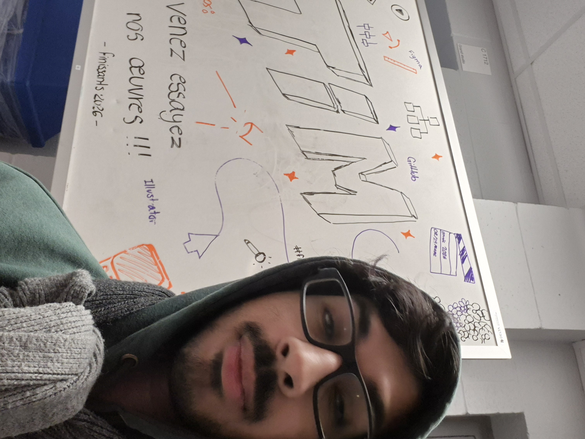

>Image prise par Hadi Ismail : Moi devant l'entrée de l'édifice

## Nom de l'exposition

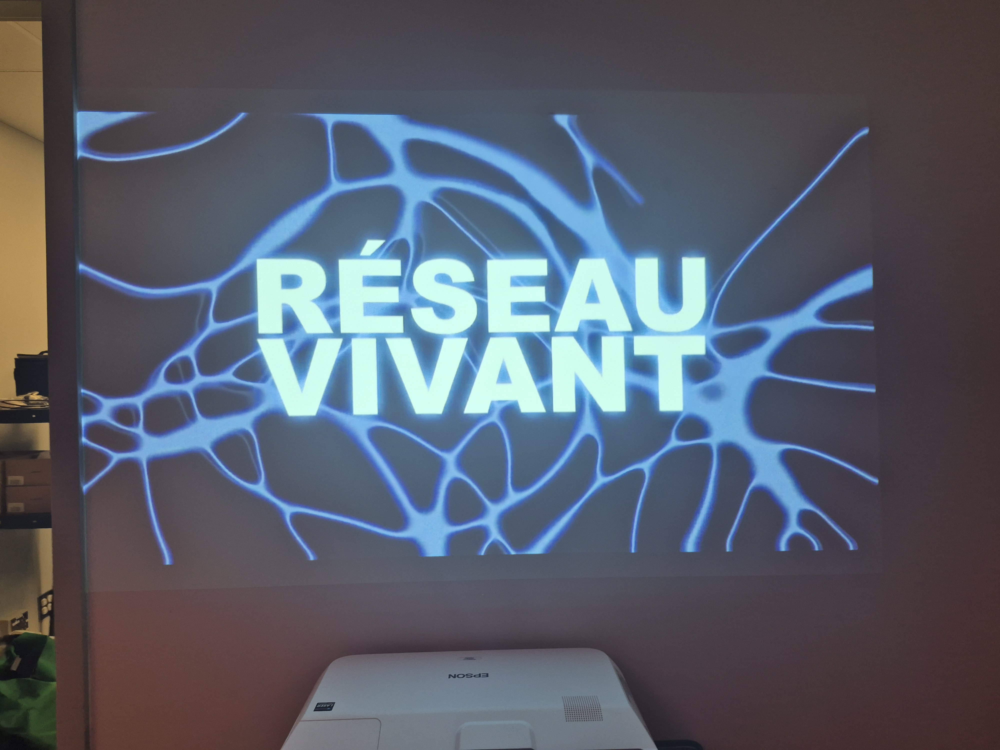

>Image prise par Hadi Ismail : Affiche pour l'exposition des finissants de TIM Montmorency

#### RÉSEAU VIVANT

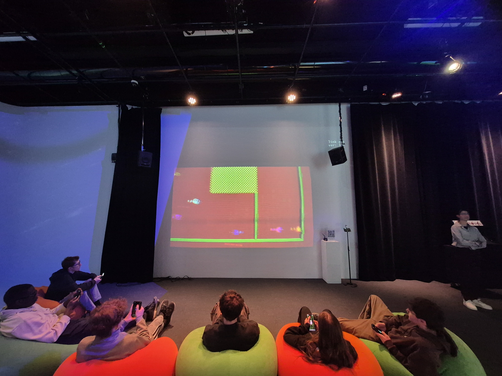

>Image prise par Hadi Ismail : Vue ensemble du projet Terminal

## Lieu de mise en exposition

Le collège Montmorency (Le grand studio) Local C-1712)

## Type d'exposition

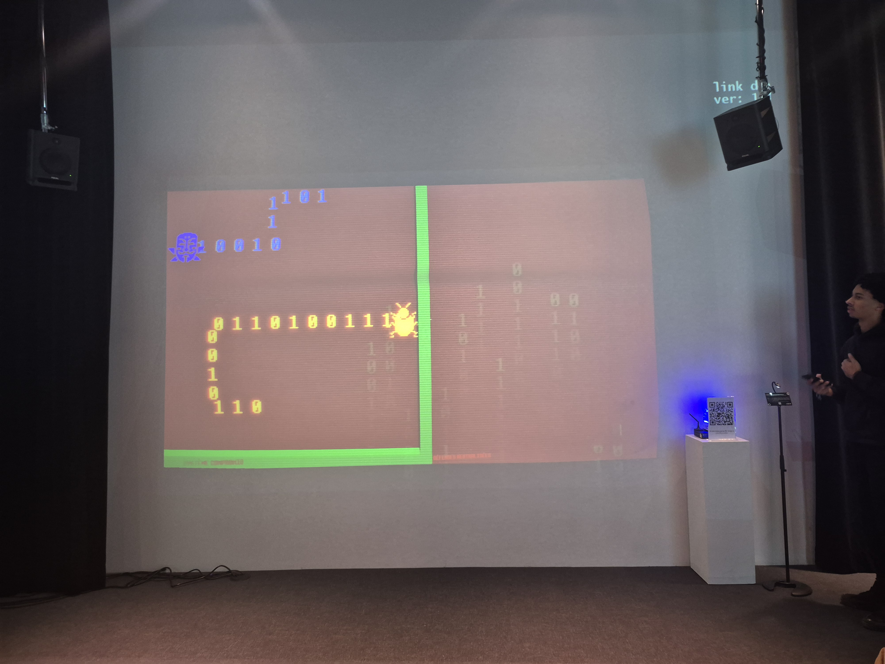

>Image prise par Hadi Ismail : Vue ensemble de l'oeuvre Terminal

Ce type d'exposition se fait à l'intérieur et est temporaire.

## Date de visite

Première visite : 24 février 2026 (projet en cours - Demo)
Deuxième visite : 17 mars 2026 (projet terminé - Résultat Final)

## Titre de l'oeuvre ou du dispositif

### TERMINAL

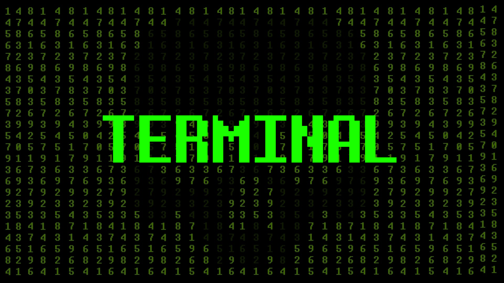

>Image prise du Github de la projet Terminal : Bannière de la projet Terminal

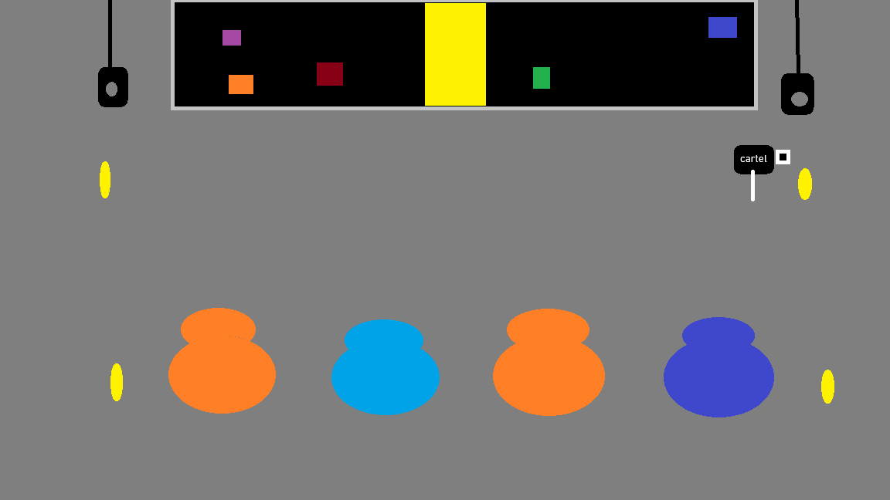

>Image dessinée par Hadi Ismail : Croquis de la pièce Terminal

## Nom de l'artiste ou de la firme

#### Le projet Terminal a été réalisé par cinq étudiants finissants du Collège Montmorency, du programme Techniques d’intégration multimédia, en 2026.

- Émeryk Bélisle

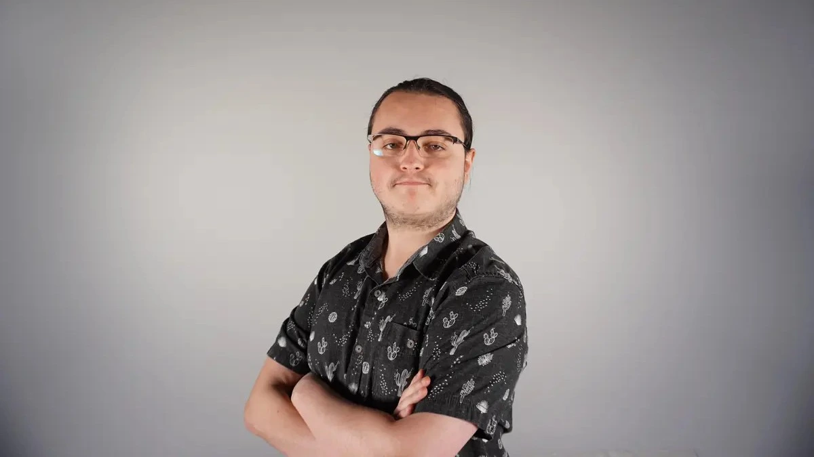

>Image prise du Github de la projet Terminal : Portrait d' Emeryk Belisle

- Elie Daher

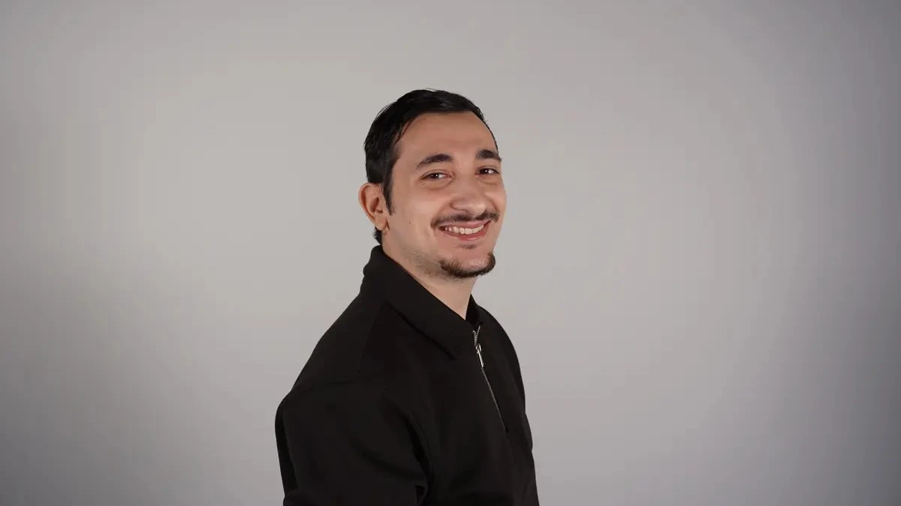

>Image prise du Github de la projet Terminal : Portrait de Elie Daher

- Ting Yung Lu Terry

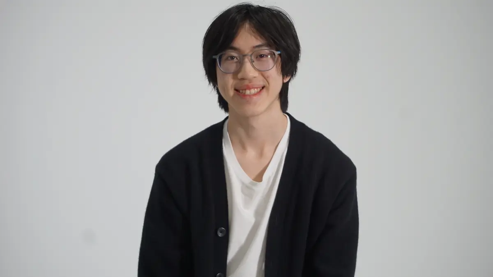

>Image prise pdu Github de la projet Terminal : Portrait de Tingyung Lu

- Dana Saavedra-Torrano

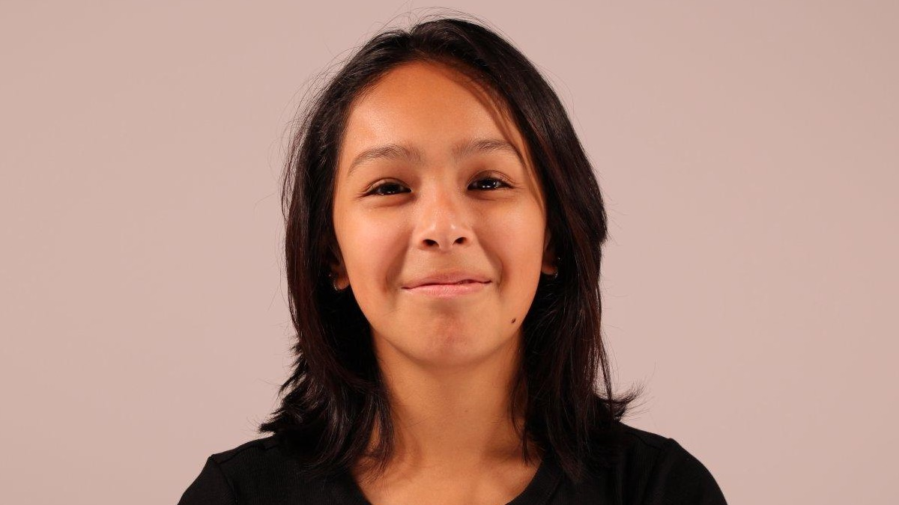

>Image prise du Github de la projet Terminal : Portrait de Dana Saavedra-Torrano

- Mégane Ranger

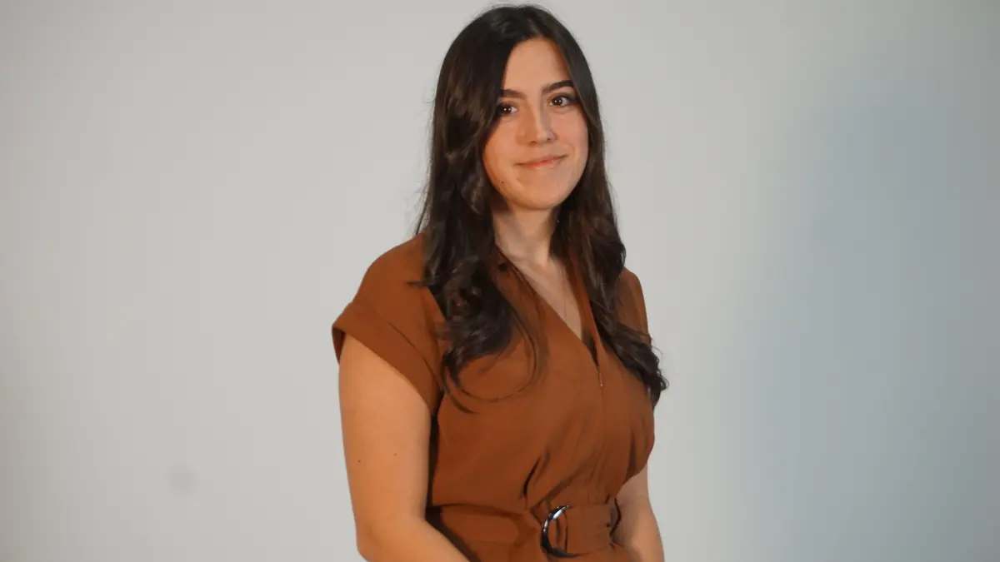

>Image prise du Github de la projet Terminal : Portrait de Megane Ranger

## Année de réalisation

#### Session d’hiver, Collège Montmorency, 2026

## Description de l'oeuvre

TERMINAL est un jeu collaboratif pouvant accueillir jusqu’à 6 joueurs. Chaque joueur contrôle un opérateur, grâce à la manette sur leur téléphone, qui essaie de trouver l'accès au vieux réseau internet afin de restaurer les données qui ont été corrompues par une cyberattaque orchestrée par un fameux pirate informatique. Lorsque les joueurs vont se déplacer, une ligne suit leur trajectoire et devient un obstacle pour les autres opérateurs. L’objectif est que tous les joueurs atteignent la fin des niveaux sans être éliminés par les obstacles laissés dans le réseau par le pirate ou par les traces laissées par les autres. En cas d’élimination, tous les joueurs doivent recommencer le niveau depuis le début. Au fur et à mesure de la progression, les niveaux deviennent de plus en plus complexes, introduisant par exemple des boutons qui ouvrent des passages pour les autres, des obstacles mobiles et bien plus encore.

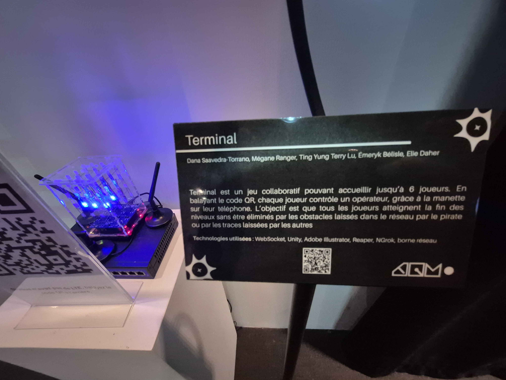

>Image prise par Hadi Ismail : Cartel de l'oeuvre Terminal

## Type d'installation 

#### Installation interactive
Le type d’installation est interactive. Les spectateurs doivent se connecter avec leur téléphone, scanner un code QR et contrôler leur personnage afin de réussir l’objectif du jeu.

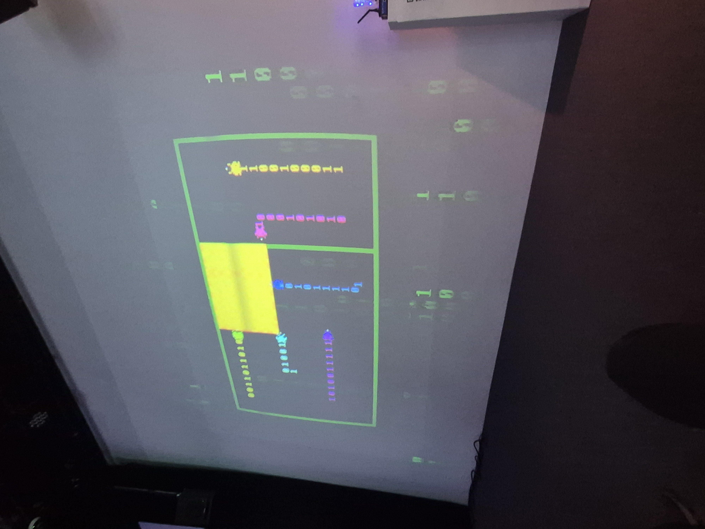

>Image prise par Hadi Ismail : Interaction de moi et de l'oeuvre Terminal

>Image prise par Hadi Ismail : Manette de l'oeuvre Terminal

## Fonction du dispositif multimédia

#### Bien que ce soit un projet réalisé par des étudiants en Techniques d’intégration multimédia, le projet Terminal comporte plusieurs dispositifs multimédias.
##### Du coding (C# - Unity)
-Permet de programmer le fonctionnement du projet et les interactions.
##### L'Audio (Reaper)
-Sert à créer et modifier les sons et la musique (Mission accomplit, Meurt, etc).
##### L'interactivité
-Permet à l’utilisateur de contrôler et influencer ce qui se passe.
##### Illustation Numérique
-Sert à créer les personnages, la scène, etc.
##### Modélisation
-Permet de créer à quoi ressemblera la scène pour les utilisateurs.
##### Animation 2D
-Sert à donner du mouvement aux éléments visuels en 2D.
##### Jeu Vidéo
-Regroupe tous ces éléments pour créer une expérience interactive complète.

## Mise en espace

L’installation du projet « Terminal » est assez imposante. Elle occupe une assez grande partie du grand studio, depuis le mur jusqu’à presque le milieu de la pièce. Le local C-1712 est un espace sombre avec 1/4 de la pièce blanche. Cette partie est couverte de grands rideaux noirs et plusieurs lumières sont au plafond.

## Composantes et techniques

Le projet Terminal utilise un projecteur, une salle sombre, un mur assez grand pour projeter l’image/le jeu, un podium pour les instructions du jeux et des places pour s’asseoir.

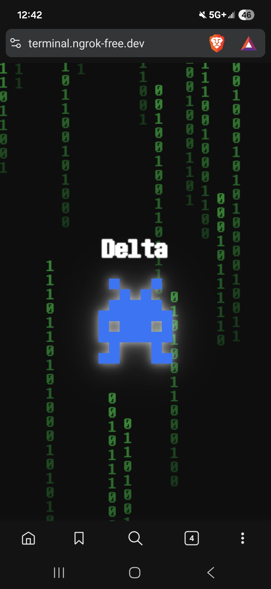

>Image prise par Hadi Ismail : Un des plusieurs avatars de l'oeuvre Terminal

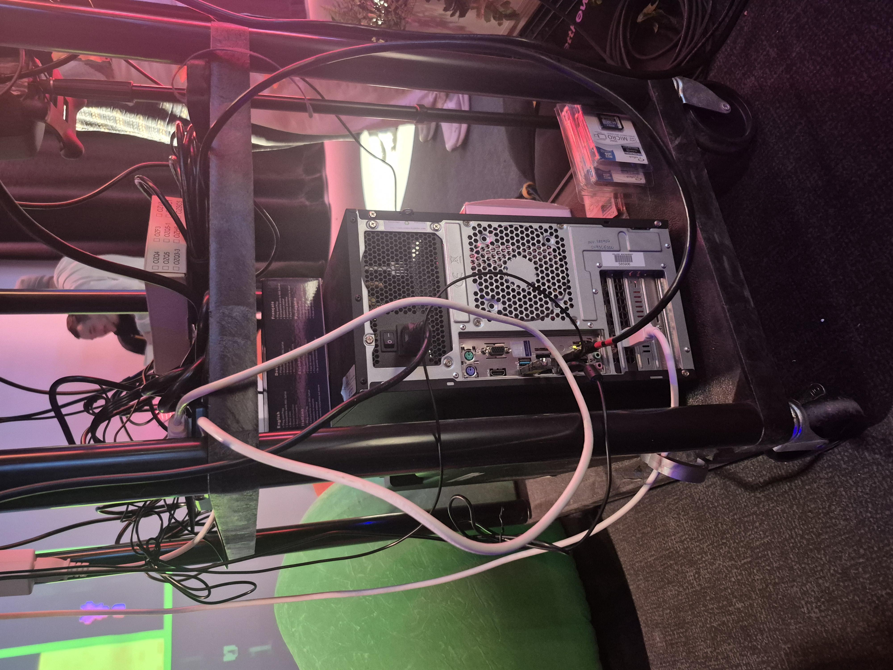

>Image prise par Hadi Ismail : Ordinateur

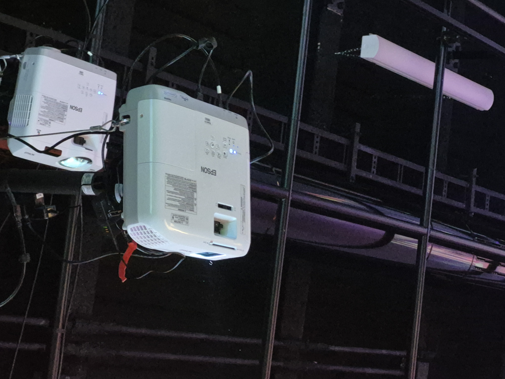

>Image prise par Hadi Ismail : Projecteur

## Éléments nécessaires à la mise en exposition

Pour la mise en exposition, il faut des chaises, dans ce cas des beanbags, un ordinateur, des LED, un code QR et le téléphone de l’audience afin d’interagir et jouer au jeu.

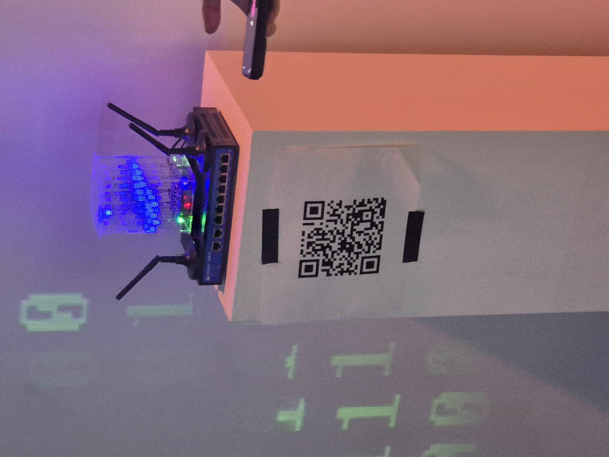

>Image prise par Hadi Ismail : Code QR pour jouer à Terminal

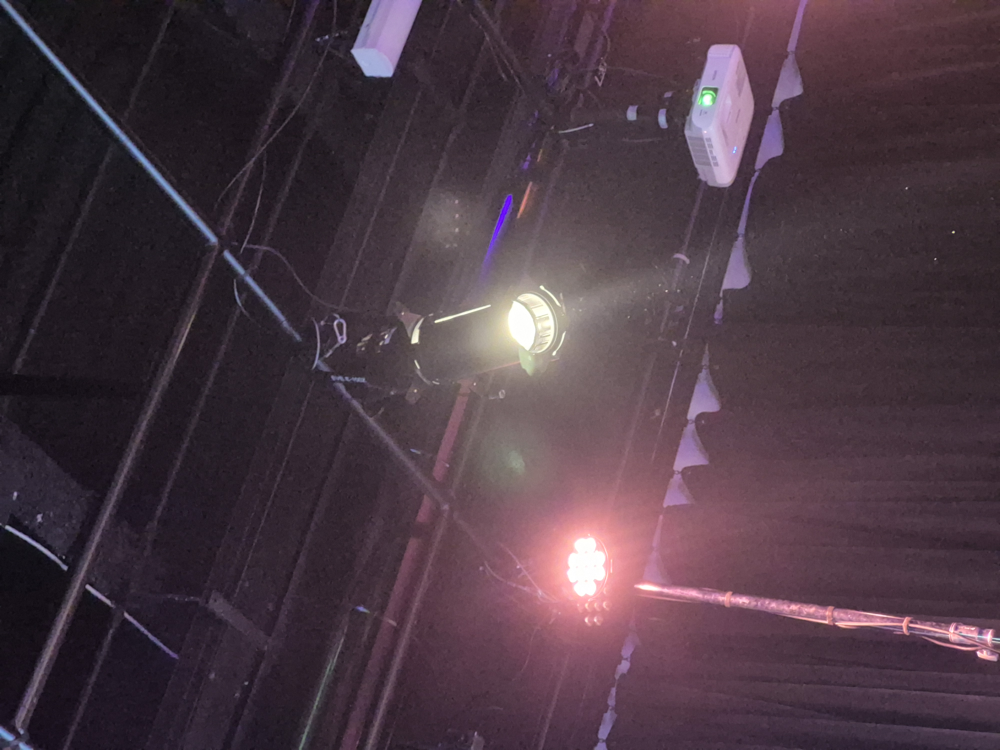

>Image prise par Hadi Ismail : lumière

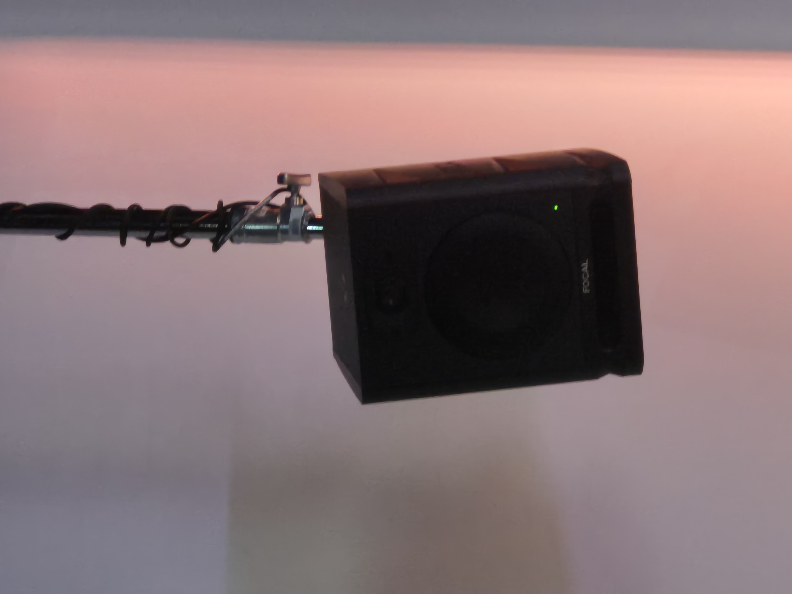

>Image prise par Hadi Ismail : Haut-Parleurs

## Expérience vécue

##### J’ai trouvé cette création très impressionnante. Comme je souhaite travailler dans la production de jeux vidéo, cette expérience m’a beaucoup marqué et m’a fait encore plus respecter les personnes qui investissent du temps et des efforts dans leurs projets.

## Ce qui m'a plu, m'a donné des idées

Ce qui m’a le plus plu dans ce projet, c’est la création du jeu et les étapes pour y arriver. Comme je veux faire un jeu vidéo plus tard, ça m’a donné des idées et m’a aidé à comprendre ce que des étudiants plus avancés ont dû faire.

## Aspect que je ne souhaite pas de retenir pour vos propres créations ou que je feré autrement

Ce que je n’ai pas apprécié, cependant, c’est le concept du jeu. J’ai trouvé que l’objectif final n’était pas très clair et que la production ne semblait pas complètement terminée. Le jeu donnait l’impression d’avoir plusieurs niveaux, mais en réalité, il n’y en avait que quelques-uns. La structure des niveaux était aussi un peu répétitive, et l’objectif final consistait simplement à atteindre un bloc vert.

Si je devais l’améliorer, je modifierais la zone de fin pour en faire quelque chose de plus significatif, comme une base ou un point d’arrivée plus élaboré. J’ajouterais également des éléments comme des clés, des objectifs pour déverrouiller des portes ou encore des ennemis afin de rendre le jeu plus intéressant et engageant.

## Références

##### Toutes les images ont été prises par le créateur de cette page (Hadi Ismail) ou proviennent du GitHub des créateurs de Terminal.

##### Émeryk Bélisle - Elie Daher - Ting Yung Lu Terry - Dana Saavedra-Torrano - Mégane Ranger

##### [https://pythons-5.github.io/Terminal/#/concept/](https://pythons-5.github.io/Terminal/#/)
