# Exposition Centre des Sciences Montréal

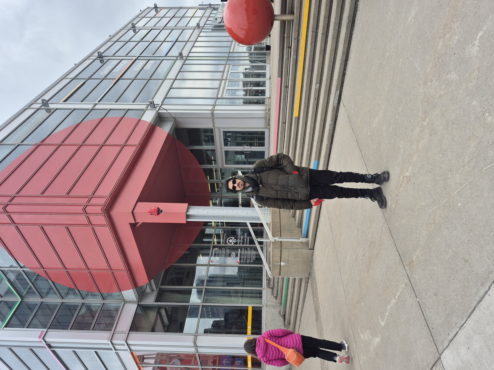

## Nom de l'exposition

#### Visite au Centre des sciences Montréal

Expédition Nordique - Northern Expidition - (NANUALUK - ᓇᓄᐊᓗᒃ) 

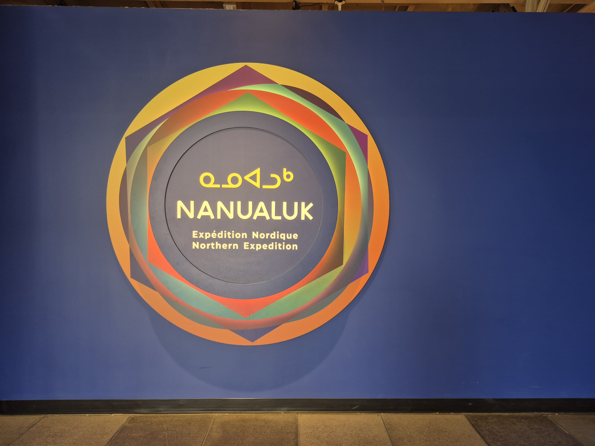

## Lieu de mise en exposition

#### Centre des sciences de Montréal, Vieux-Port de Montréal

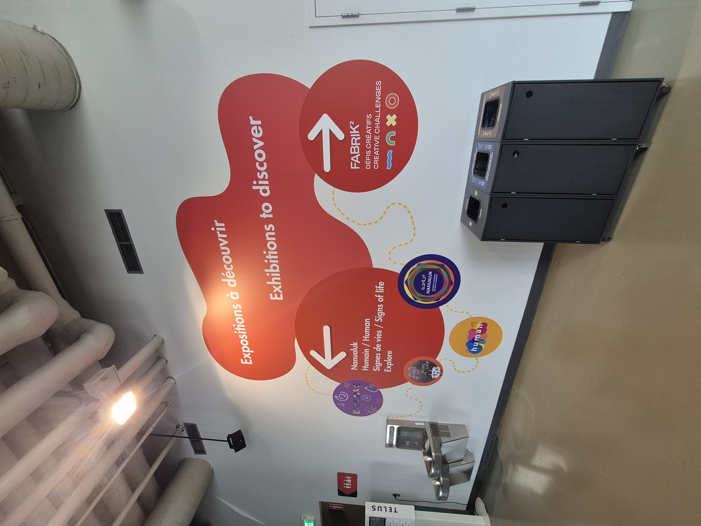

## Type d'exposition

#### Cette exposition est principalement permanente, mais elle comprend aussi plusieurs expositions temporaires.

(L'exposition sur laquelle nous nous concentrerons sera l'une des expositions temporaires.)

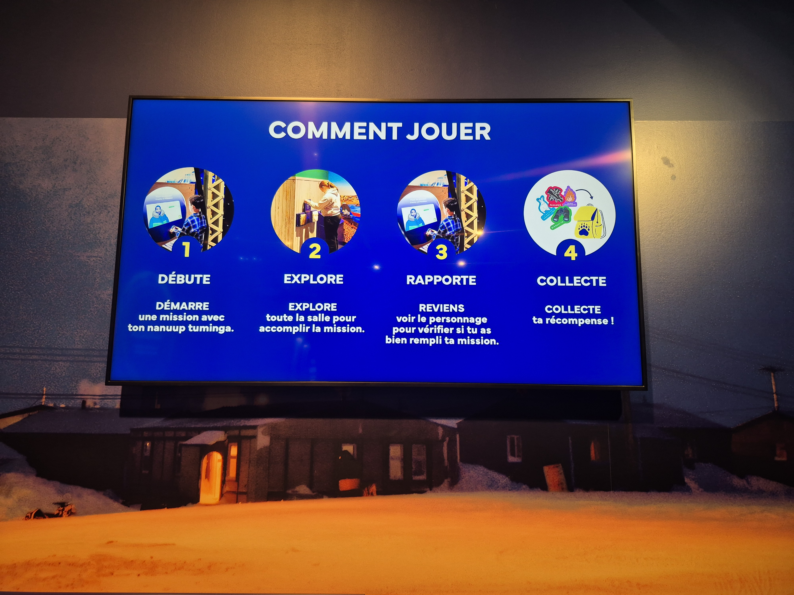

## Date de visite

Jeudi 2 avril 2026

## Titre de l'oeuvre ou du dispositif

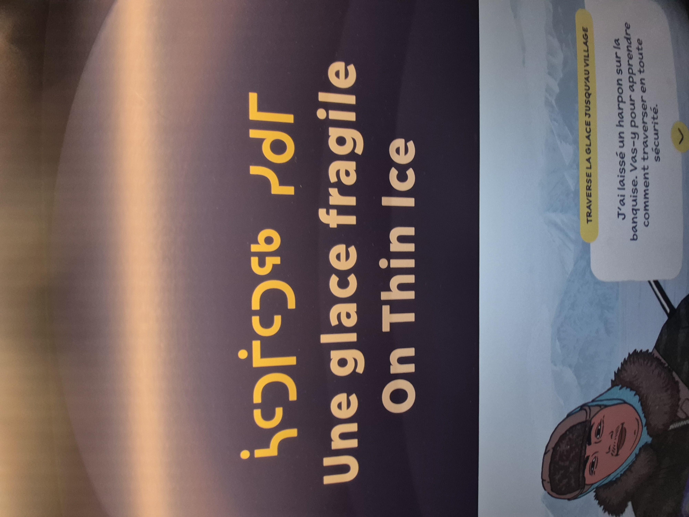

Une glace fragile - On Thin Ice - ᓴᑦᑐᒦᑦᑐᖅ ᓯᑯᒥ

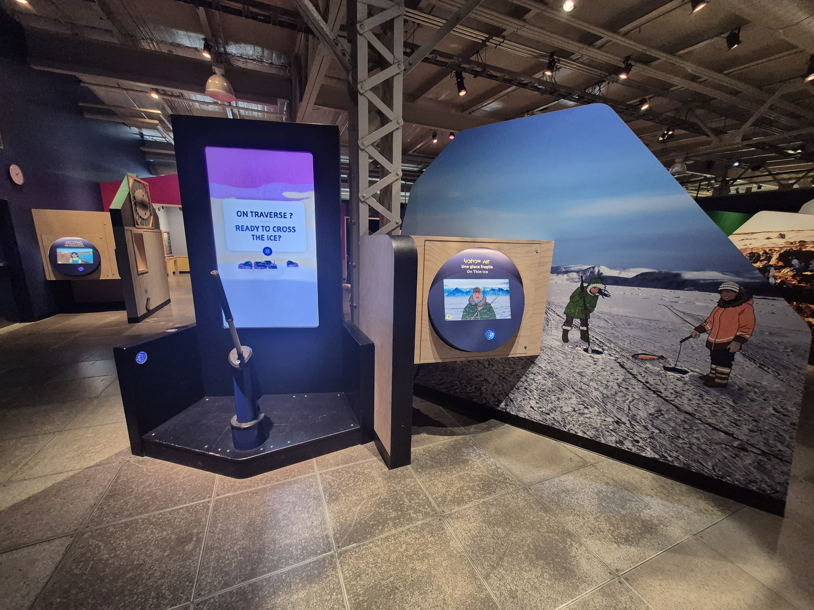

## Nom de l'artiste ou de la firme

La firme de cette exposition est le Centre des sciences de Montréal, en collaboration avec des partenaires autochtones et scientifiques.

## Année de réalisation

L'exposition Nanualuk – Expédition nordique a été inaugurée au Centre des sciences de Montréal le 1er mars 2025.

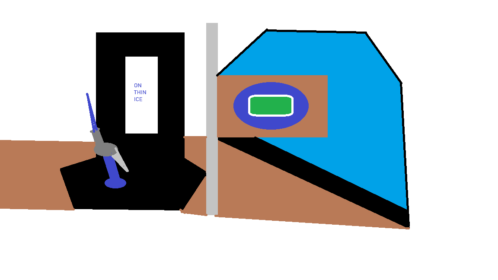

## Description de l'oeuvre

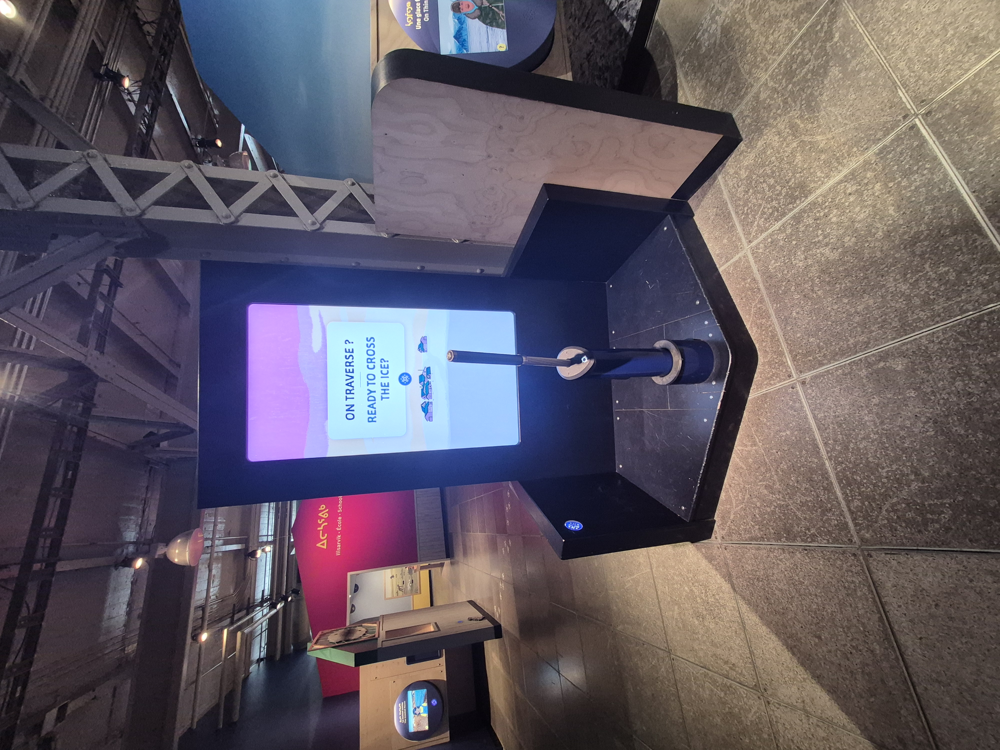

Cette oeuvre est simple. Vous devez retourner au village où vous habitez, mais pour cela vous devez traverser un lac recouvert de glace. Soyez très prudent, car la glace fond au printemps. Pour vérifier si la glace est assez solide pour marcher dessus, on utilise une unaaq, une lance, pour taper sur la glace avant de traverser.

(Le cartel est expliqué par l'homme qui donne essentiellement la description de l'objet utilisé, la raison de son utilisation et comment jouer au jeu, etc.)

##### Voici où le jeu commence et il y a 3 règles simples :

- Si vous pouvez frapper la glace 3 fois avec la lance sans qu’elle se brise ou présente des fissures, cela signifie qu’elle est assez épaisse pour traverser. Sinon, vous devez éviter la zone et essayer un autre chemin,   ou vous perdez une vie.

- Vous devez éviter les obstacles tels que les ours polaires, sinon vous perdez une vie.

- Vous devez terminer le voyage avant la tombée de la nuit, sinon le jeu se termine automatiquement et vous perdez.

- Vous avez 3 vies. Lorsque vous êtes prêt à avancer, cliquez sur le petit bouton sur la lance. Si vous voulez aller à gauche ou à droite, orientez la lance dans la direction souhaitée. Si vous voulez tester si la glace est fragile ou non, appuyez vers le bas sur la lance.

##### Une fois que vous atteignez la fin du lac gelé, vous arrivez au village et vous gagnez la partie. Bonne Chance!

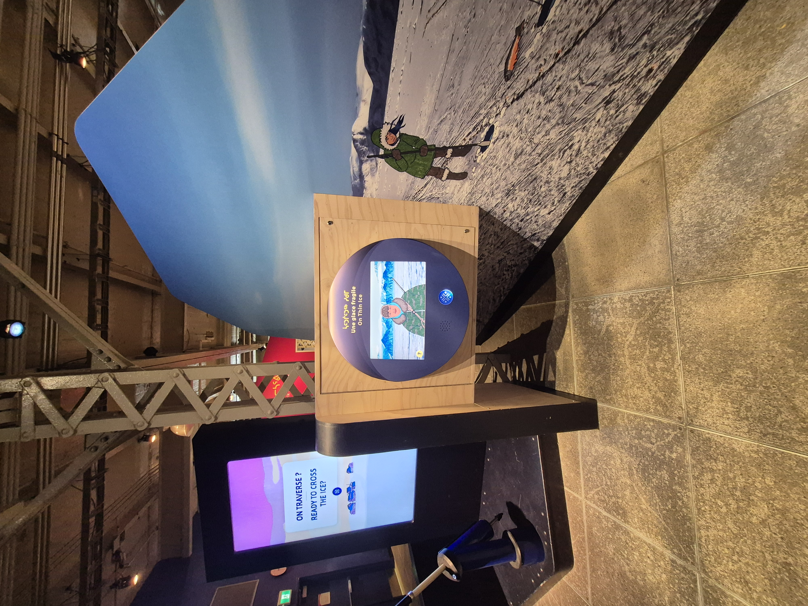

## Type d'installation 

#### Installation interactive

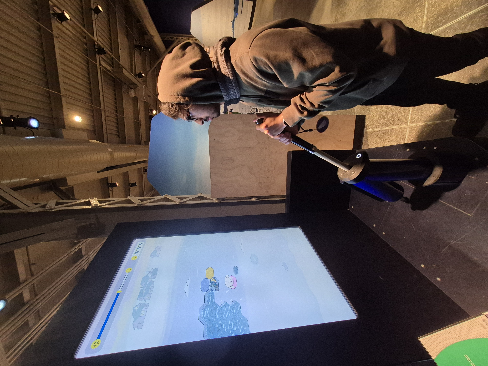

Cette oeuvre est une installation interactive car elle ne peut pas fonctionner sans ton intervention directe. Le contenu à l'écran réagit en temps réel à tes mouvements physiques et à tes choix quand tu manipule l'unaaq qui sert de manette pour diriger le personnage et tester la solidité du sol.

## Fonction du dispositif multimédia

#### Pour la fonction du dispositif multimédia, il comporte 4 aspects.

- Diffusion du patrimoine immatériel

- Support pédagogique

- Mise en contexte

- Mise en valeur

## Mise en espace

L’espace occupé pour cette œuvre est assez grand. Il se compose de deux sections. La première section contient un écran expliquant l’utilisation de l’unaaq et comment s’en servir. La deuxième section est la principale attraction : on y trouve un grand écran affichant le jeu. Devant cet écran se trouve la lance, qui sert à contrôler le personnage. Et c’est à peu près tout. 

## Composantes et techniques

- Deux écrans : Un petit écran pour les tutoriels et un grand écran principal pour le jeu.

- Contrôleur physique (L'Unaaq) : Une lance traditionnelle équipée d'un bouton et de capteurs de mouvement.

- Un ordinateur : caché dans la boîte en bois pour faire fonctionner le logiciel et gérer les interactions.

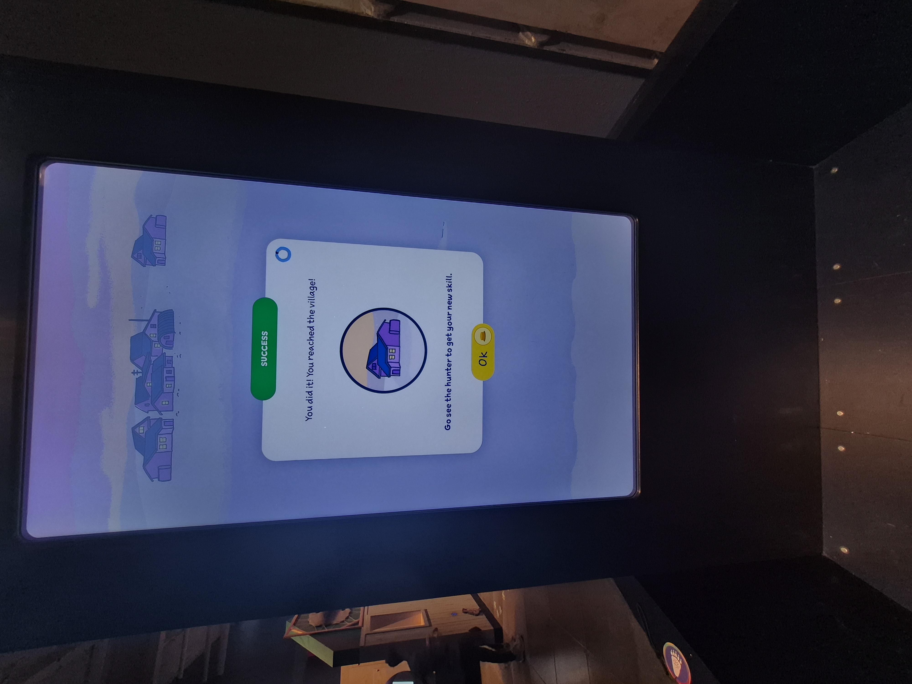

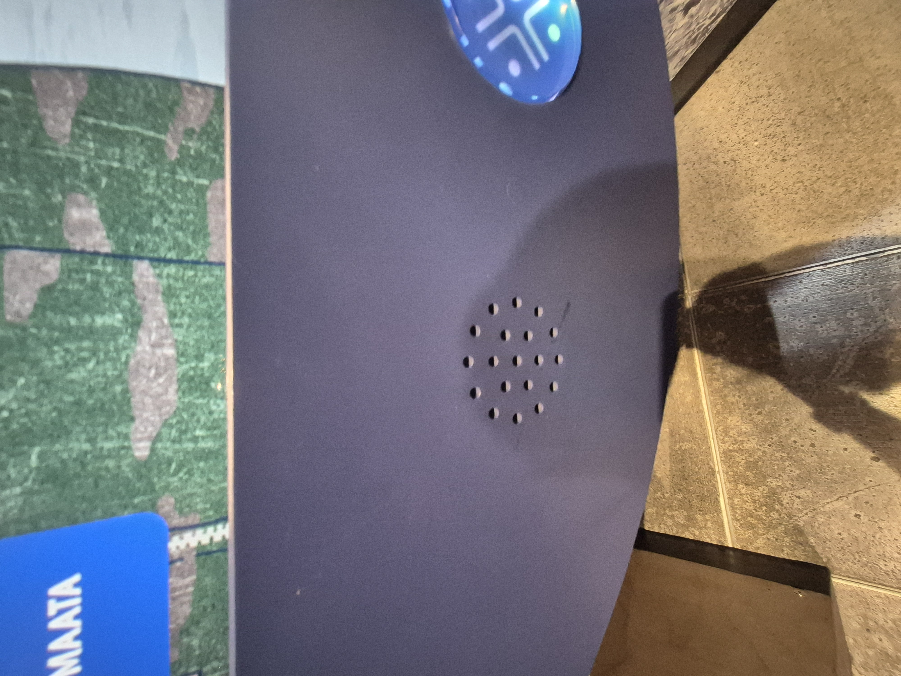

## Éléments nécessaires à la mise en exposition

- Espace physique : Il faut prévoir une zone assez grande pour l'oeuvre

- Un moniteur : Pour le tutoriel et un grand écran immersif pour l'affichage du jeu.

- Système de contrôle : Une lance (contrôleur)

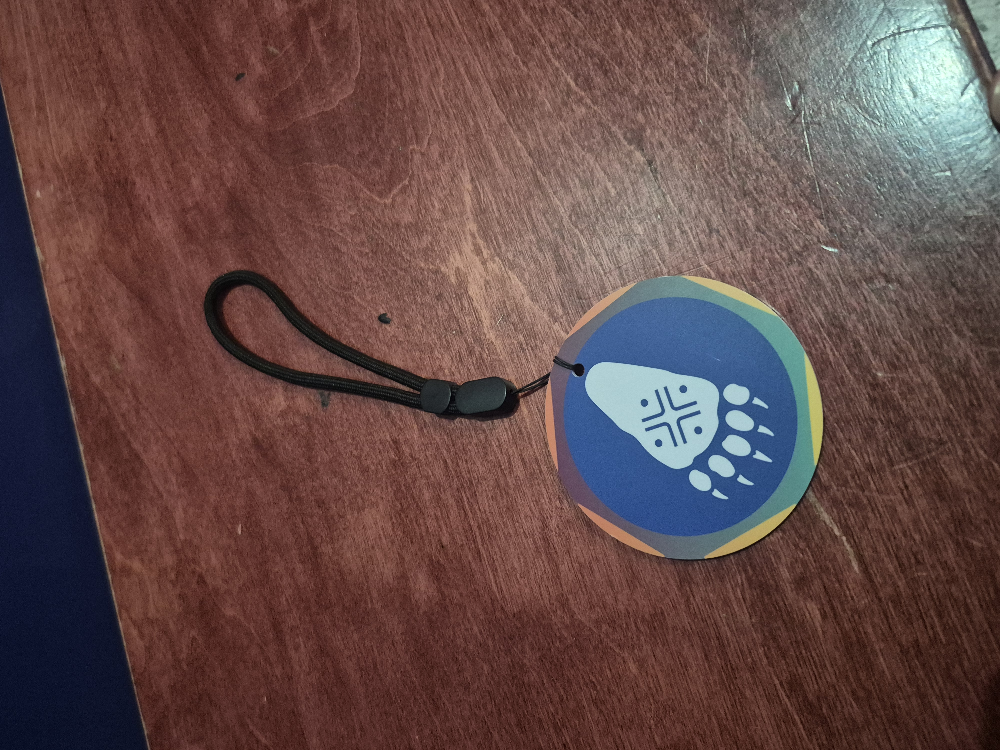

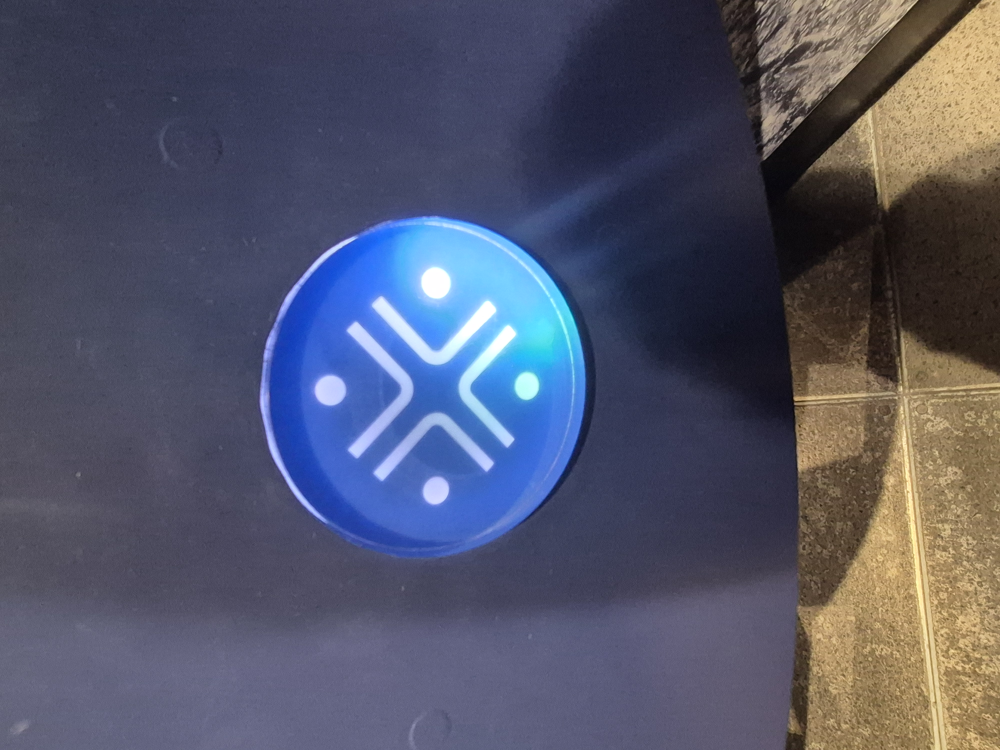

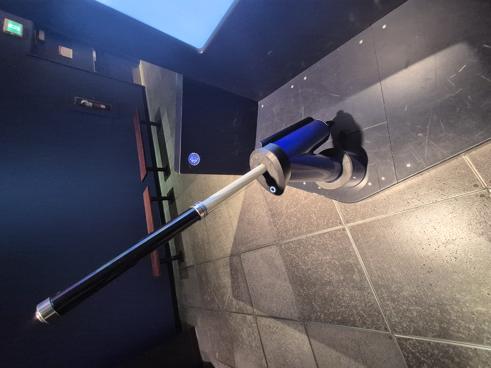

## Expérience vécue

Comment je me suis senti : d’abord, cette expérience m’a rappelé des souvenirs de ma première visite au Centre des sciences de Montréal lors de ma première session. Quand je suis revenu à cette exposition, j’étais un peu surpris et confus, car je ne savais pas que l'oeuvre temporaire changer chaque année. Je pensais qu’elles étaient toutes permanentes, mais je me trompais.

Maintenant, comment je me suis senti sur l’œuvre : c’était une expérience incroyable. Je passais surtout du temps à observer l’œuvre temporaire en me déplaçant entre les différentes sections, et je suis allé revoir certaines anciennes œuvres que j’avais déjà testées. Découvrir des anciens installations a aussi été une très bonne expérience, car sa m'a donner beaucoup de nostalgie.

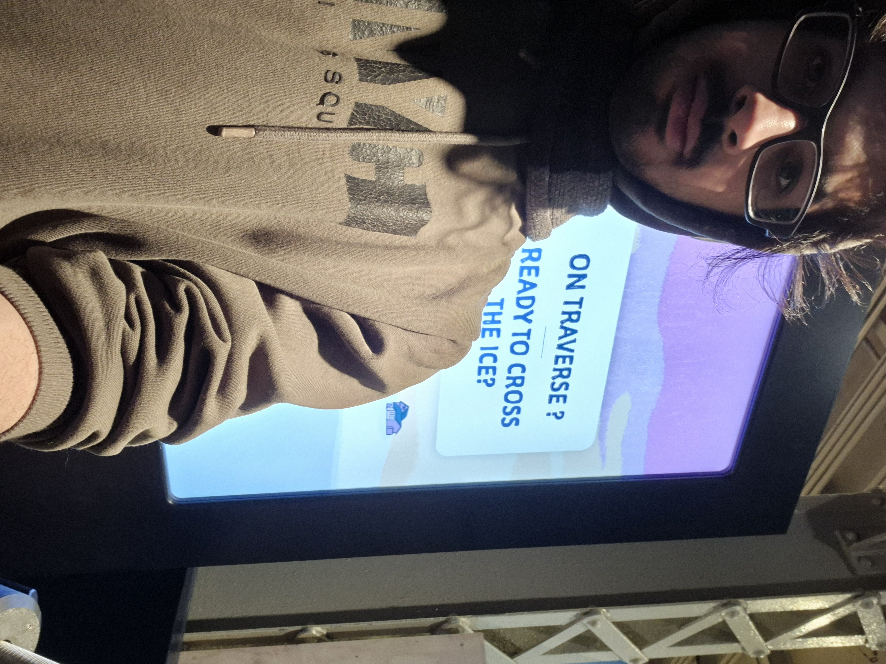

## Ce qui m'a plu, m'a donné des idées

#### Ce qui m'a plu : 

C’est la reconnaissance et la mise en valeur des cultures autochtones. En tant que Canadiens, il est essentiel d’être mieux éduqués sur les premiers peuples de ce continent, leur mode de vie et leurs traditions. L’œuvre utilise l’interaction pour transformer cet apprentissage en une expérience concrète qui permet de mieux comprendre la réalité des autres.

#### Ce qui m'a donné des idées : 

l’aspect interactif m’a donné des idées sur la façon de toucher un public cible. En tant qu'étudiant en multimédia, j'ai réalisé que nous devons apprendre à anticiper différentes perspectives pour mieux servir notre audience. Cette expérience m’a permis de voir comment l'interactivité peut transmettre un message éducatif.

## Aspect que je ne souhaite pas de retenir pour vos propres créations ou que je feré autrement

L’aspect que je ne retiendrai pas est le trajet pour me rendre à l’exposition, car les directions n’étaient pas très claires. C’était une expérience désagréable à cause de la distance, du froid et du passage par des endroits qui semblaient un peu vague. Mais ces aspects ne peut pas être modifié, alors je ne m'en inquiéterais pas trop.

## Références

### Toutes les images ont été prises par le créateur de cette page (Hadi Ismail), sauf le logo.

### Toutes les images peuvent être trouvées au Centre des sciences de Montréal.

### L'entreprise responsable : Centre des sciences de Montréal - Vieux-Port de Montréal

### https://www.centredessciencesdemontreal.com/ (Voici le site web de Centre des sciences Montréal)

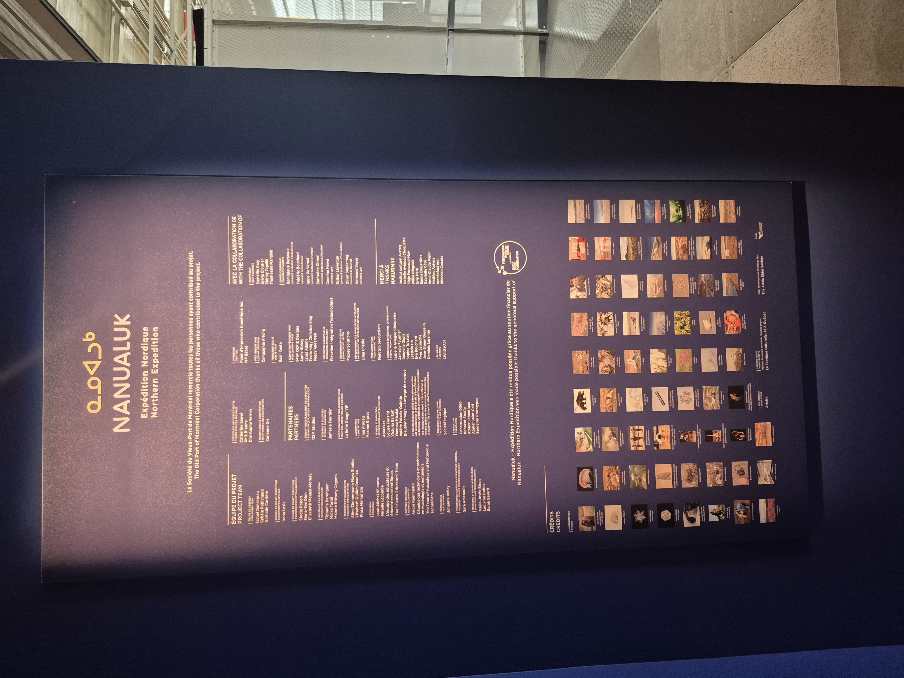

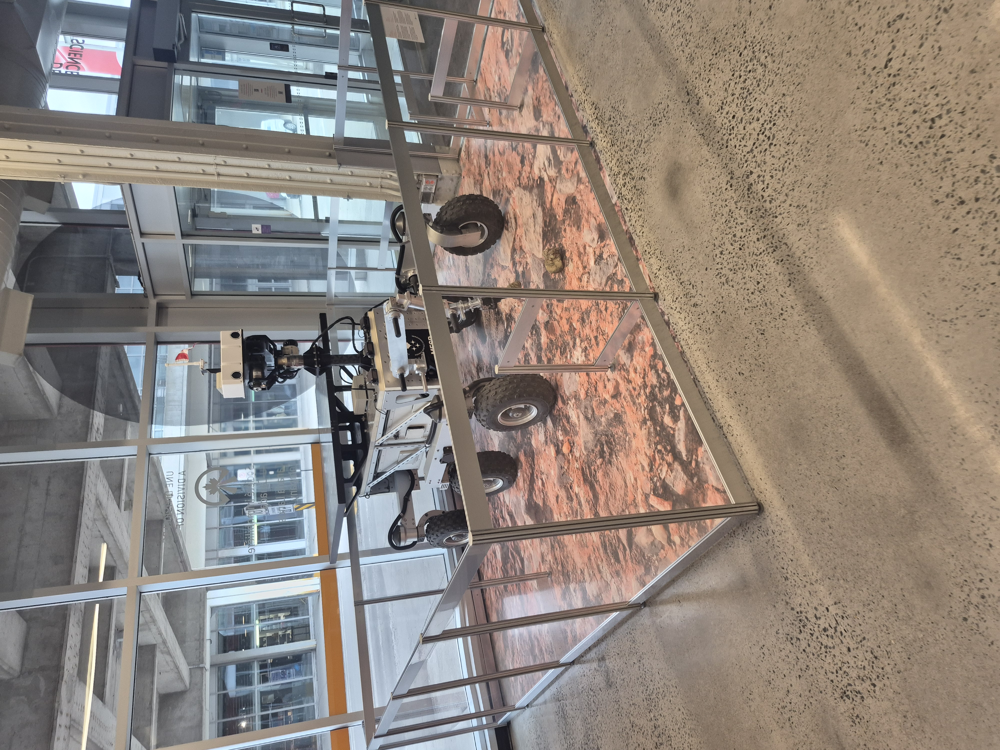

