# Festival Lumino

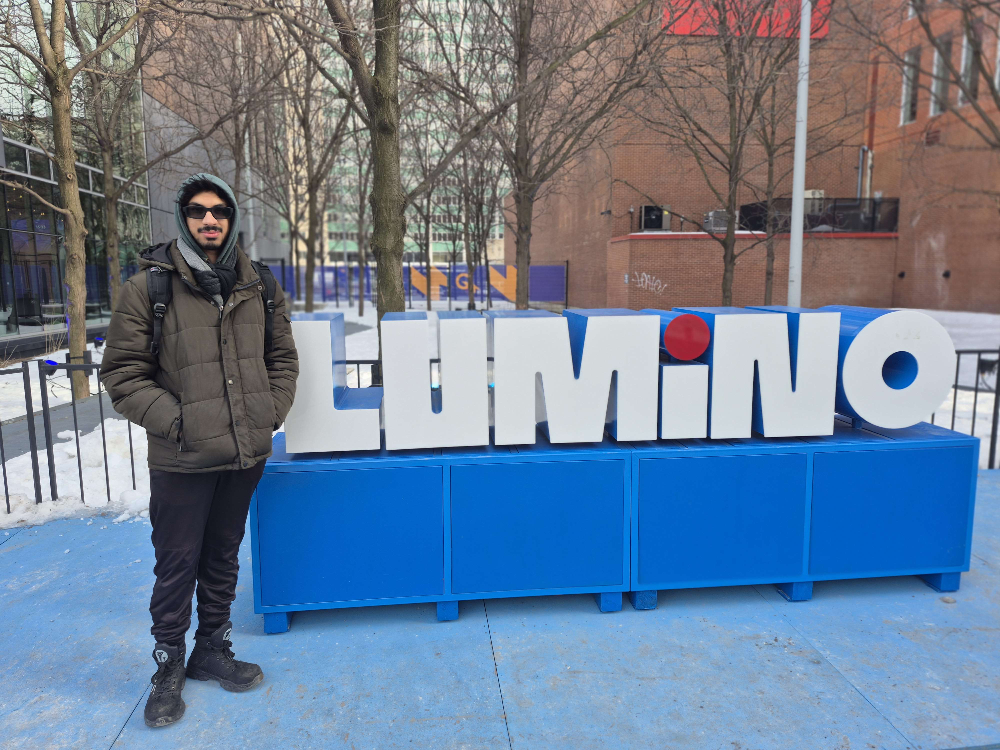

>Image prise par Hadi Ismail : Logo de Lumino

## Nom de l'exposition

Festival d'hiver Lumino (16e édition)

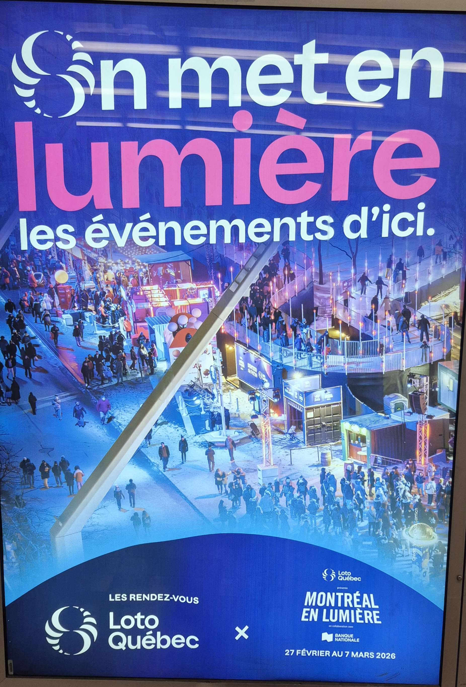

>Image prise par Hadi Ismail : Affiche pour l'exposition du festival d'hiver

## Lieu de mise en exposition

Esplanade Tranquille, Quartier des spectacles, Montréal.

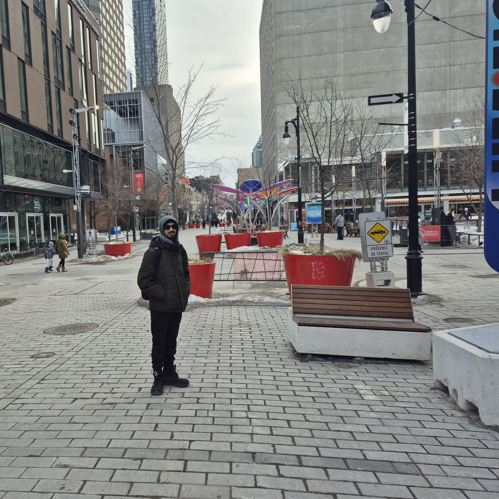

>Image prise par Hadi Ismail : Moi devant l'entrée du festival d'hiver

## Type d'exposition

Pour le type d'exposition, c'est un peu compliqué.

Cette exposition a toujours lieu à l'extérieur, mais, bien que la patinoire elle-même soit une installation permanente de l'Esplanade, les œuvres interactives et les projections vidéo qui l'animent changent chaque année.

## Date de visite

5 Mars 2026

## Titre de l'oeuvre ou du dispositif

### Le coffre à jouet dégivré

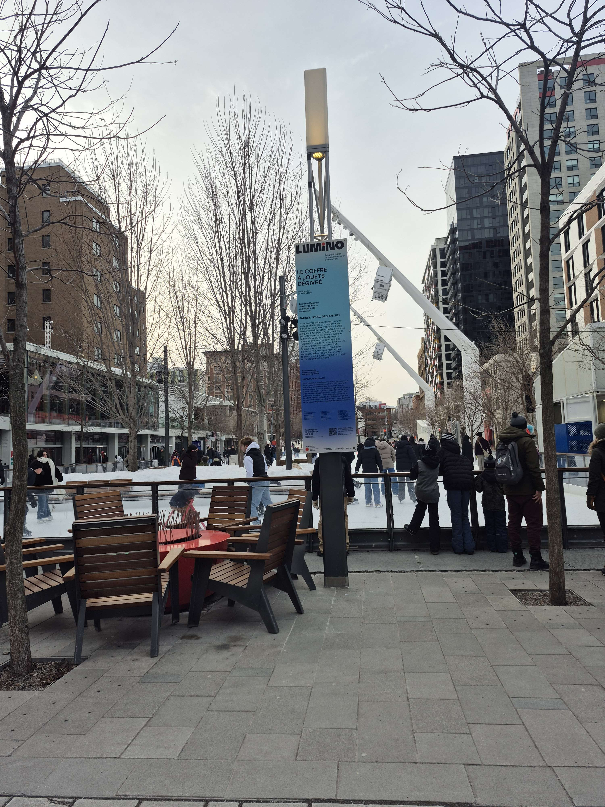

>Image prise par Hadi Ismail : Vue ensemble de l'oeuvre le coffre à jouets dégivré

## Nom de l'artiste ou de la firme

L'installation « Le coffre à jouets dégivré » est une collaboration entre deux studios montréalais spécialisés en design d'expérience numérique et en création interactive.
### Ottomata et Doki

## Année de réalisation

Ce projet a été terminé à la fin de novembre 2024

## Description de l'oeuvre

#### Le coffre à jouet dégivré
"PATINEZ, JOUEZ, DÉCLENCHEZ Attachez vos patins et sautez sur une surface glacée qui se transforme en portail vers vos jeux d'enfance. Faites l'expérience interactive de trois mondes suniques: l'Autoroute Zéro-Gravité, une piste flottante aux éléments planants, le Monde Néon, dont les formes et couleurs évoquent l'esthétique des machines à boules et Le sol est en lave!, un univers volcanique et tropical. Chacun de ces tableaux, d'une durée de trente minutes, vous réserve des surprises. Selon vos déplacements sur la glace, vous pourriez même provoquer un dénouement inattendu!"
##### - SOURCE : Cartel du coffre à jouet dégivré

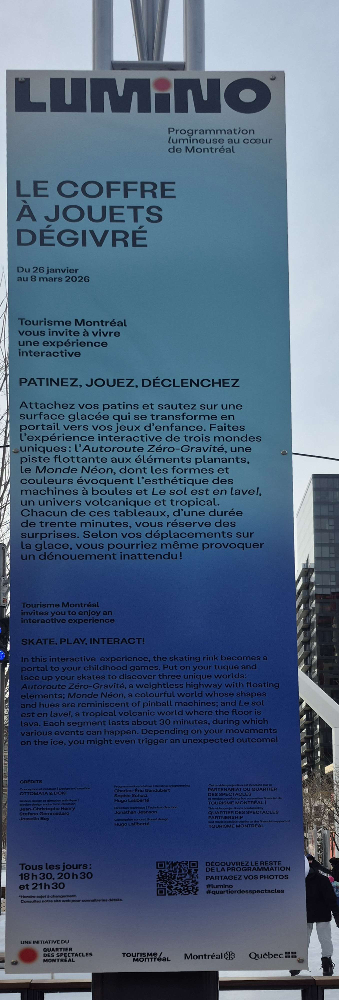

>Image prise par Hadi Ismail : Cartel de le coffre à jouets dégivré

## Type d'installation 

L'installation « Le coffre à jouets dégivré » est une expérience interactive à grande échelle.

## Fonction du dispositif multimédia

##### Scénographie
##### Mise en valeur
##### Diffusion du patrimoine immatériel

## Mise en espace

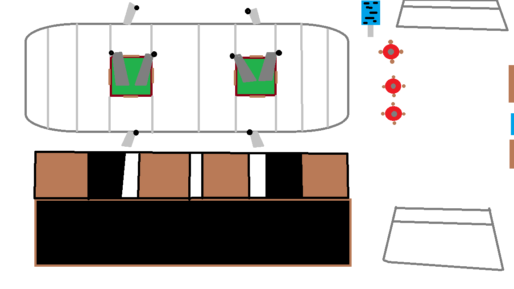

>Image dessinée par Hadi Ismail : Croquis de le coffre à jouets dégivré

L’installation est massive et couvre toute la surface de la patinoire de l’Esplanade Tranquille, soit environ 1 500 m². À l’extérieur de l’arène, on trouve des bancs et des feux de camp autour de la patinoire. À l’intérieur, il y a aussi des bancs au centre ainsi que quatre à huit poteaux de projection de lumière.

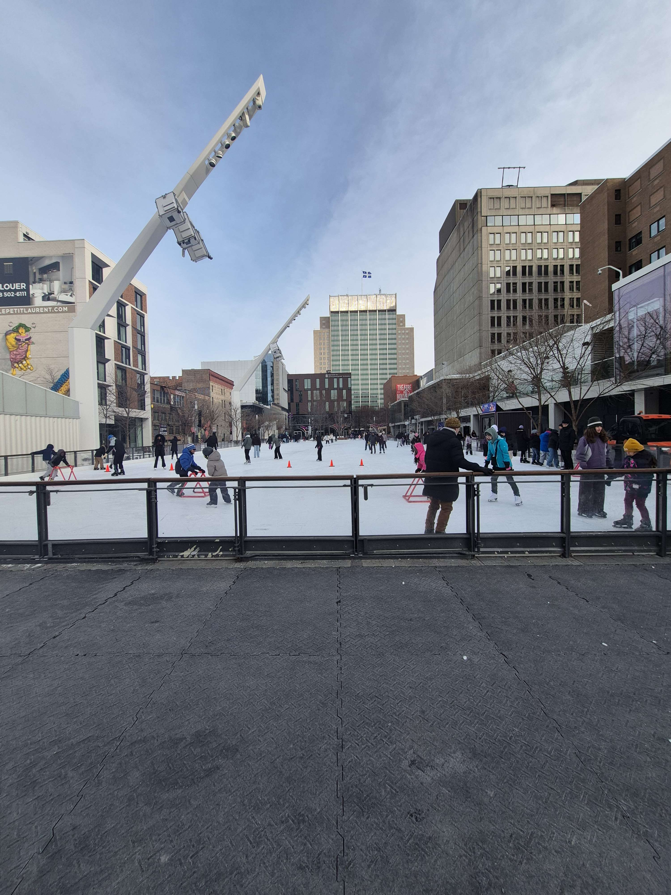

>Image prise par Hadi Ismail : Vue ensemble de le coffre à jouets dégivré

## Composantes et techniques

L’installation utilise des cameras, des lumières, des systèmes de captation de mouvement et des vidéoprojecteurs laser montés sur des poteaux.

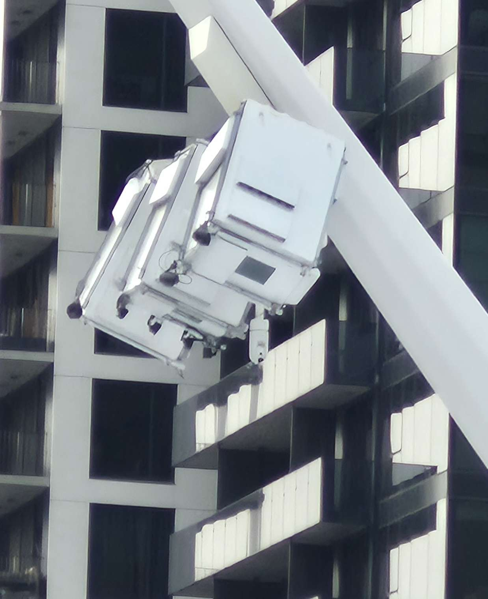

>Image prise par Hadi Ismail : Appareil vidéoprojecteurs

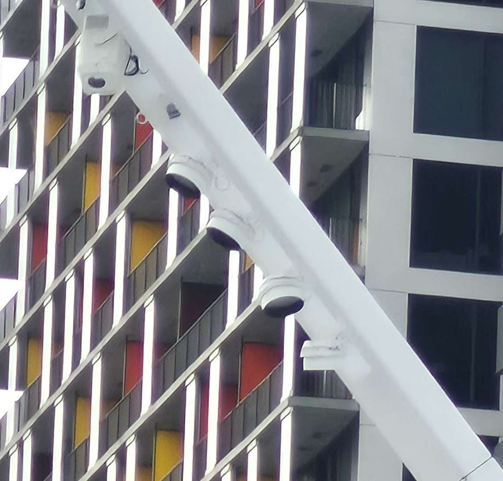

>Image prise par Hadi Ismail : Camera et des lumières

## Éléments nécessaires à la mise en exposition

Pour exposer l’oeuvre, il faut une patinoire extérieure de 1 500 m², des cameras, des lumières, des capteurs de mouvement, des vidéoprojecteurs laser installés sur des poteaux, et un aménagement incluant des bancs et des foyers pour accueillir le public dans un environnement hivernal et finalement des chaises et des feux de camp.

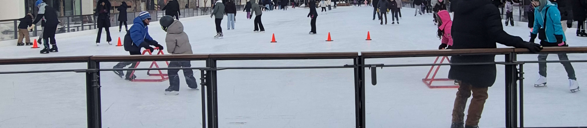

>Image prise par Hadi Ismail : La patinoire

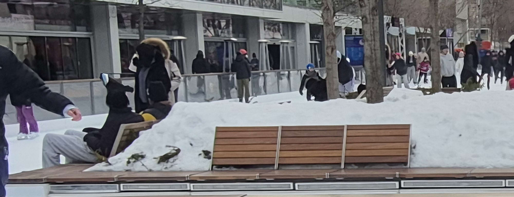

>Image prise par Hadi Ismail : les bancs à l'intérieur de la patinoire

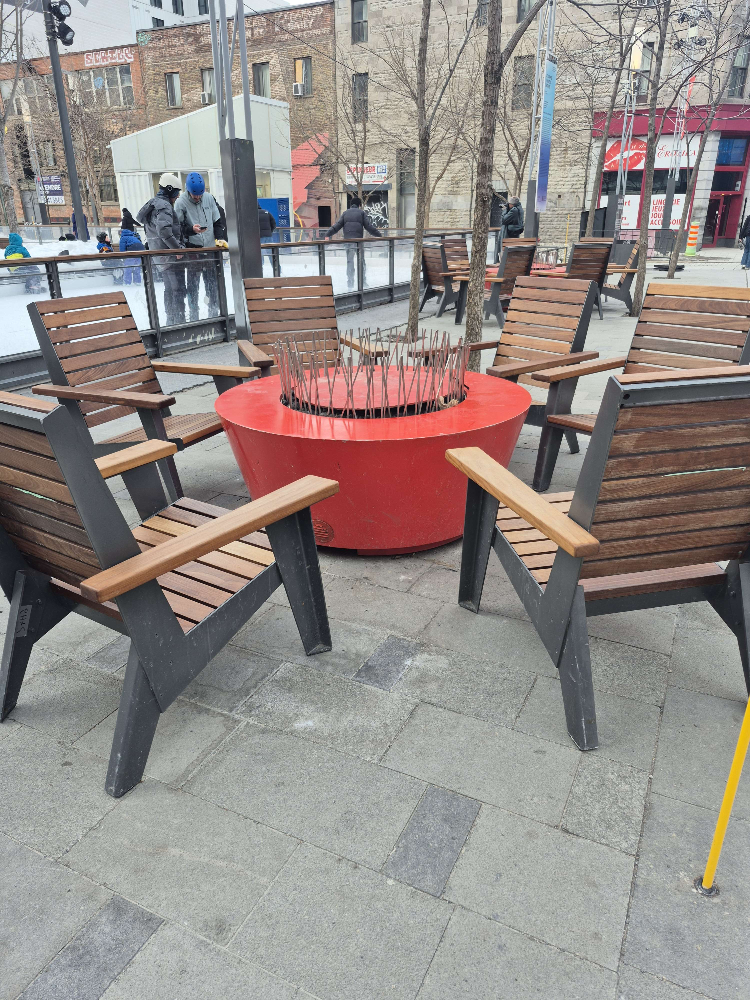

>Image prise par Hadi Ismail : Les chaises et les feux de camp

## Expérience vécue

Malgré le froid intense et la fatigue liée au jeûne du Ramadan, l'expérience sur la patinoire a été marquante et énergisante. Accompagné de mon ami qui est venu m'aider pour ce projet, nous avons exploré l'ensemble du festival pour découvrir les différentes installations. C'était impressionnant de voir que l'événement était gratuit et immense. Je dirais que l'experice était bien excitent.

## Ce qui m'a plu, m'a donné des idées

Ce qui m'a le plus plu, c'est d'avoir mon ami à mes côtés, je ne serais pas venu seul, donc sa présence était vraiment le meilleur moment. Même si l'endroit était un peu loin, la vue et l'emplacement étaient incroyables. L'atmosphère était rafraîchissante. Ça m'a fait beaucoup de bien de sortir explorer au lieu de rester assis à la maison devant l'ordinateur. C'était une expérience vraiment positive et inspirante.

## Aspect que je ne souhaite pas de retenir pour vos propres créations ou que je feré autrement

Pour mes propres créations, je ferais autrement pour la gestion du froid et de la visibilité. Il n’y avait presque pas de chaufferettes, ce qui rendait l’attente difficile quand il faisait très froid. De plus, il fallait être là à une heure précise pour bien voir les lumières, ce qui était difficile pour les visiteurs. Dans mon projet, je prévoirais plus de zones confortables pour le public et je rendrais l’œuvre visible à n’importe quel moment, sans dépendre d’un horaire trop strict.

## Références

### Toutes les images ont été prises par le créateur de cette page (Hadi Ismail)

Titre de l'oeuvre : Le coffre à jouets dégivré

Créateurs : Studios Ottomata et Doki

Événement : Festival Lumino (16e édition)

Production : Partenariat du Quartier des spectacles de Montréal

Lieu : Esplanade Tranquille, Montréal

Année : 2025-2026 (réalisation 2024)

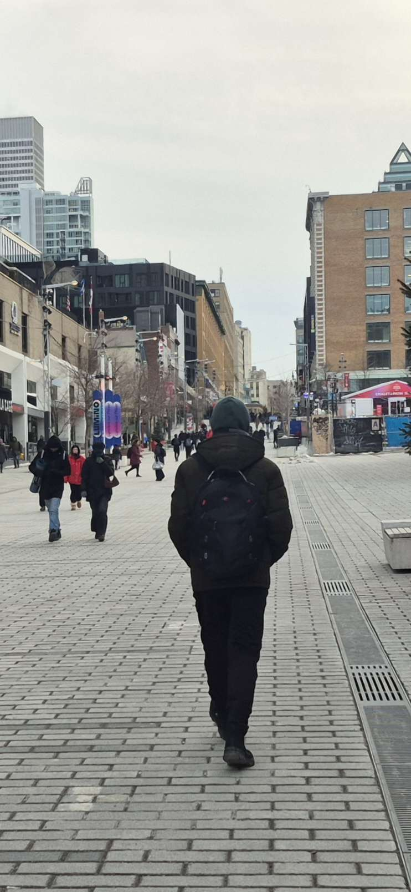

>Image prise par Hadi Ismail :

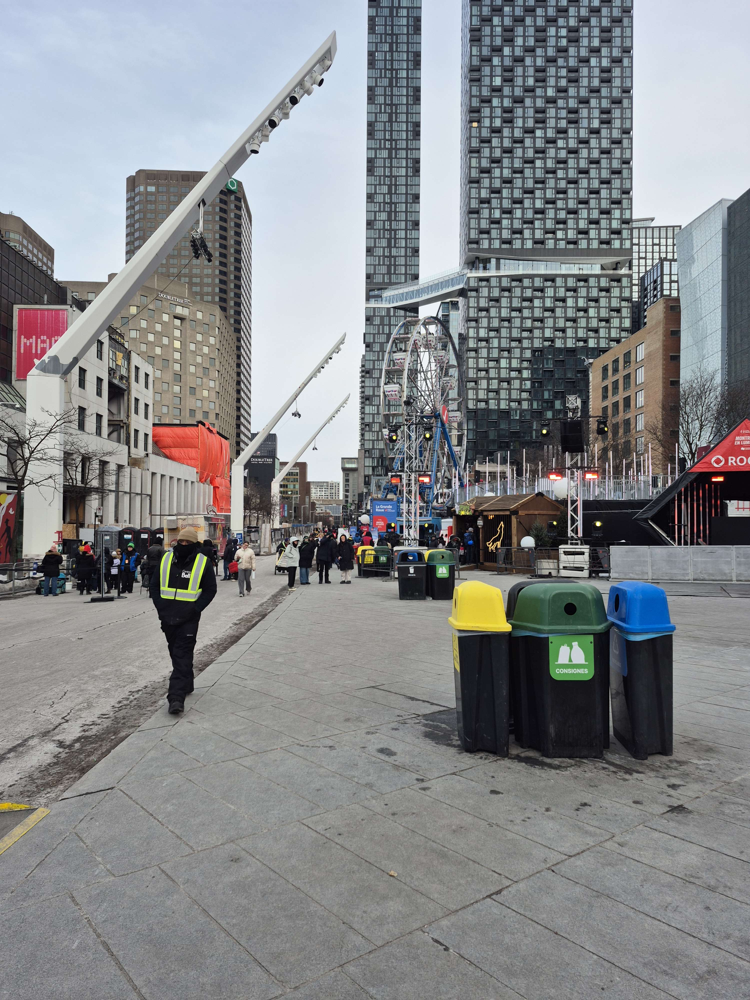

>Image prise par Hadi Ismail :

