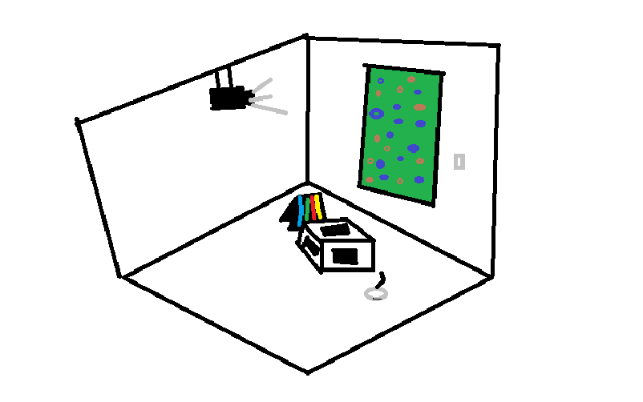
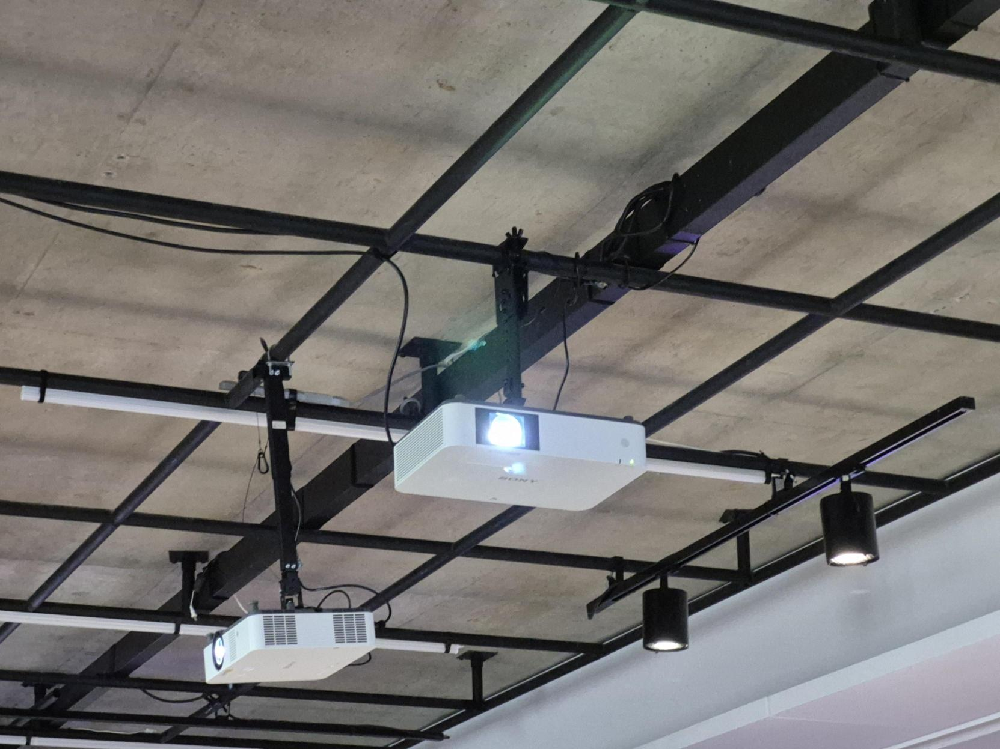
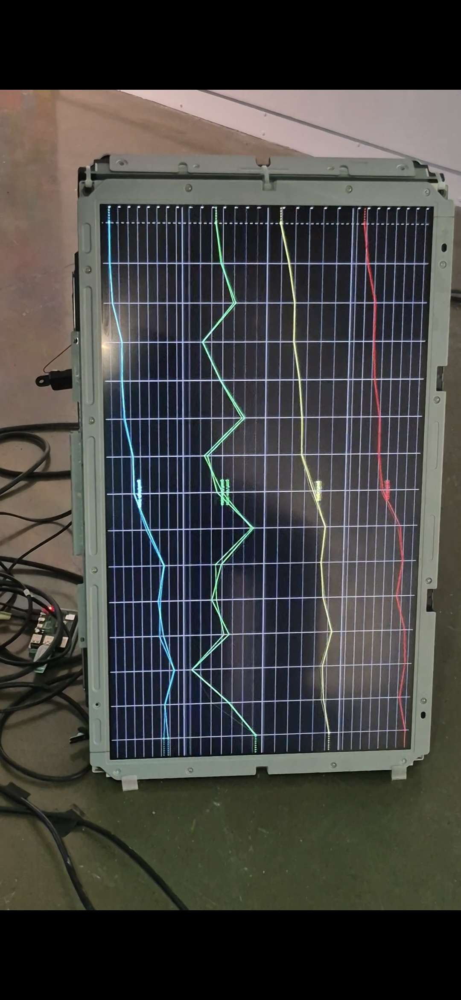

# VISITE D'EXPOSITION

  
## Nom de l'exposition
 
Devenir partagé. Pratique de l'IA

#### Image prise : https://galerie.umontreal.ca/
 
## Lieu de mise en exposition
 
Galerie de l'université de Montréal
 
## Type d'exposition
 
Intérieur et temporaire

 
## Date de visite
 
29 Janvier 2026
 
## Titre de l'oeuvre ou du dispositif 
 
Terre Commune

 
## Nom de l'artiste ou de la firme
 
Marion Schneider
 
## Année de réalisation
 
Production de 2025
 
## Description de l'oeuvre
 
Terre commune explore les zones de contact entre cognition humaine. IA et mondes naturels. Marion Schneider a collecté des images de sols forestiers afin d'entraîner une IA générative à produire des représentations à partir de ces données. Des images nouvelles se déploient en temps réel selon l'activité cérébrale du public, et plus précisément les ondes alpha - associées au sommeil et à la méditation - afin d'influencer les aléas de la génération visuelle. En conviant les personnes à porter attention à notre terre, L'artiste propose de faire l'expérience d'un co-ancrage entre êtres humains, machines et forêts. Le projet sonde ainsi la possibilité d'utiliser l'IA afin de favoriser une coexistence interespèces à la fois apaisée et connectée. En résonance avec les ecologies queer, se distanciant des dualismes nature et technologie ou repos et productivité, l'installation propose une méditation sur nos interdépendances et sur les manières dont la technologie peut devenir un partenaire de soin et d'attention partagée.

 
## Type d'installation 
 
Installation interactive
 
## Fonction du dispositif multimédia
 
Mise en valeur, mise en contexte et scénographie immersive de l’oeuvre.
 
Le dispositif multimédia sert à la mise en valeur et à la mise en contexte de l’oeuvre grâce à une scénographie interactive et immersive qui favorise une expérience contemplative.

 
## Mise en espace 
 
L’oeuvre est installée dans un espace intérieur sombre avec une projection. Il y avait aussi un genre de pc qui était connecté à un écran qui projetait une image générée d’AI selon ce que pensait la personne lorsqu’elle portait un genre de casque (casque eeg).

 
## Composantes et techniques 
 
L’installation utilise un ordinateur, un casque EEG, des écrans et vidéoprojecteurs, ainsi que des éléments en aluminium et acrylique. Les images sont générées en temps réel par une AI entraînée avec des données collectées par l’artiste dans les Laurentides, et leur variation dépend des ondes cérébrales du public via le casque EEG.
 
## Éléments nécessaires à la mise en exposition
 
Pour exposer l’oeuvre, il faut un espace intérieur sombre, un ordinateur, un casque EEG, des écrans ou vidéoprojecteurs, des éléments en aluminium et acrylique pour la structure, et un système pour générer et projeter les images en temps réel.

 
## Expérience vécue
 
L’expérience m’a beaucoup intéressé, car je veux travailler dans le futur avec la VR ou la réalité mixte. En portant le casque, les images changeaient selon nos pensées, ce qui rendait l’interaction différente pour chaque personne, ce qui était fascinant.

 
## Ce qui m'a plu, m'a donné des idées
 
Ce qui m’a plu, c’est que l’œuvre utilise l’IA pour créer une expérience unique pour chaque personne qui utilise la casque.
 
## Aspect que je ne souhaite pas de retenir pour vos propres créations ou que je feré autrement
 
Je ne retiendrais pas le manque de détails sur le casque EEG. Pour mes propres créations, j’ajouterais plus d’informations sur la technologie et sur la manière de l’utiliser correctement afin que le public comprenne mieux le fonctionnement.
 
## Références (l'auteur.(e) images et photos)
 
Marion Schneider - artiste numérique non binaire diplômé(e) en arts visuels et médiatiques et en design numérique.
 
Oeuvre observée : Terre commune, présentée à l’exposition Devenirs partagés. Pratiques de l’IA, Galerie de l’Université de Montréal
